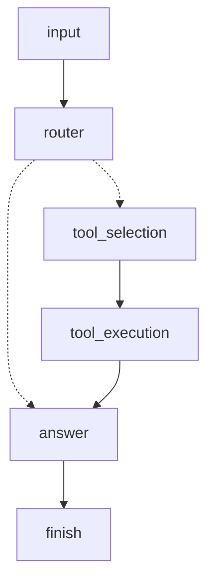

# broflow

A lightweight, zero-dependency Python library for building workflows where each step
decides what happens next **on the fly** — a router picking a tool, a retry loop, a
multi-turn agent conversation. No server, no scheduler, no external state store: a
flow is just plain Python objects, run in-process.

## What is broflow?

broflow is built around the **register pattern**: instead of wiring every step together
ahead of time, each step is a small, self-contained task that decides its own next step
at runtime and simply names it. A registry resolves names to tasks; a `Flow` runs
whatever the current task decides, one step at a time.

- 🔀 **Connect on the fly** — a task's next step is a live decision inside its own
  code, not something wired externally before the flow runs. That's what makes real
  branching and loops (retries, multi-turn agent conversations) possible without a
  static graph to keep consistent.
- 🪶 **Lightweight, zero dependencies** — built entirely on the Python standard library
  (`abc`, `typing`, `enum`, `dataclasses`). Nothing to install beyond broflow itself,
  nothing running in the background.
- 🧩 **Customize at will** — `BaseTask` is the entire contract: do the work, call
  `set_next(...)`. Task identifiers, state, and control flow are all yours to shape;
  broflow doesn't impose a schema on any of them.

## Installation

```bash
pip install broflow
```

## The three pieces

```python
from broflow import BaseTask, TaskRegistry, Flow
```

- **`BaseTask`** — one unit of work. Receives whatever you pass to `Flow.run`, does
  something, and calls `self.set_next(...)` to say where the flow goes from here.
- **`TaskRegistry`** — a name → task lookup. Tasks never hold references to each
  other, so nothing needs to exist yet at the moment a task names where it's going.
- **`Flow`** — the engine. It doesn't know anything about your tasks: it calls
  whichever one is `current`, checks if that was the terminal step, and looks up
  whatever `current` decided was next.

## Quick start

Build a small agent loop: take input, route to a tool only if one's needed, then answer.

```python
from dataclasses import dataclass
from enum import StrEnum
from broflow import BaseTask, TaskRegistry, Flow

class Process(StrEnum):
    INPUT = 'input'
    ROUTER = 'router'
    TOOL_SELECTION = 'tool_selection'
    TOOL_EXECUTION = 'tool_execution'
    ANSWER = 'answer'
    FINISH = 'finish'

@dataclass
class State:
    input: str = ''
    tool_use: str = ''
    tool_result: str = ''
    answer: str = ''

class UserInput(BaseTask):
    possible_next = {Process.ROUTER}
    def __call__(self, state: State):
        state.input = "What's the weather in Tokyo?"
        self.set_next(Process.ROUTER)
        return state

class Router(BaseTask):
    possible_next = {Process.TOOL_SELECTION, Process.ANSWER}
    def __call__(self, state: State):
        needs_tool = "weather" in state.input.lower()
        self.set_next(Process.TOOL_SELECTION if needs_tool else Process.ANSWER)
        return state

class ToolSelection(BaseTask):
    possible_next = {Process.TOOL_EXECUTION}
    def __call__(self, state: State):
        state.tool_use = "get_weather"
        self.set_next(Process.TOOL_EXECUTION)
        return state

class ToolExecution(BaseTask):
    possible_next = {Process.ANSWER}
    def __call__(self, state: State):
        state.tool_result = "22C, clear skies"
        self.set_next(Process.ANSWER)
        return state

class Answer(BaseTask):
    possible_next = {Process.FINISH}
    def __call__(self, state: State):
        state.answer = f"It's {state.tool_result} in Tokyo." if state.tool_result else "Sure, what do you need?"
        self.set_next(Process.FINISH)
        return state

registry = TaskRegistry()
registry.register(Process.INPUT, UserInput(name="input"))
registry.register(Process.ROUTER, Router(name="router"))
registry.register(Process.TOOL_SELECTION, ToolSelection(name="tool_selection"))
registry.register(Process.TOOL_EXECUTION, ToolExecution(name="tool_execution"))
registry.register(Process.ANSWER, Answer(name="answer"))

flow = Flow(registry)
final_state = flow.run(start=Process.INPUT, end=Process.FINISH, state=State())
print(final_state.answer)
# It's 22C, clear skies in Tokyo.
```

`Router` only routed through the tool because its own logic decided to — nothing
outside `Router` declared that edge as the one to take. Swap the input and it takes the
other path, with no rewiring required anywhere else.

## Connecting on the fly: branching and loops

There's no `>>`/`-` chaining here — a task branches by calling `set_next` with whatever
its own logic decides, and that includes routing back to an earlier step:

```python
class Answer(BaseTask):
    possible_next = {Process.INPUT, Process.FINISH}
    def __call__(self, state: State):
        self.set_next(Process.INPUT if state.wants_another_turn else Process.FINISH)
        return state
```

Wiring `Process.INPUT` back through `Answer` turns the whole flow into a multi-turn
loop — `input → router → ... → answer → input → router → ... → answer → finish` — for
as many turns as `Answer` decides, with no special machinery required. This works
safely because nothing in broflow tracks predecessors or "waits for" other branches; a
task only ever looks forward, to whatever it names next.

## Inspecting a flow

Every run records exactly what happened, and — separately — you can inspect what a
flow *could* do without running it at all.

**What actually happened**, recorded automatically on every `Flow.run` call:

```python
print(flow.trace)
# [('input', <Process.ROUTER: 'router'>), ('router', <Process.TOOL_SELECTION: 'tool_selection'>),
#  ('tool_selection', <Process.TOOL_EXECUTION: 'tool_execution'>),
#  ('tool_execution', <Process.ANSWER: 'answer'>), ('answer', <Process.FINISH: 'finish'>)]
```

**What a flow could possibly do**, from each task's optional `possible_next` — useful
for documentation, code review, or a diagram, but never read by `Flow` itself:

```python
from broflow import to_edges, to_tree, to_mermaid

print(to_tree(registry, start=Process.INPUT, terminate=Process.FINISH))
```
```
input
  -> router
    -> answer
      -> finish
    -> tool_selection
      -> tool_execution
        -> answer
```

```python
print(to_mermaid(registry, start=Process.INPUT, terminate=Process.FINISH))
```


A dashed edge (`-.->`) marks a task with more than one `possible_next` — a real branch
point, where only one edge actually fires on any given run. A solid edge (`-->`) marks
a task with exactly one path forward.

`to_edges` gives you the same information flattened into a plain, sorted `(from, to)`
list — meant to be diffed in git or asserted on in a test, not read as a picture:

```python
print(to_edges(registry))
# [('answer', 'finish'), ('input', 'router'), ('router', 'answer'),
#  ('router', 'tool_selection'), ('tool_execution', 'answer'), ('tool_selection', 'tool_execution')]
```

## Customize at will

broflow doesn't impose a schema on any of the pieces above:

- **State** can be anything — a `dataclass` (as above), a plain dict, a custom class.
  `Flow.run` forwards whatever keyword arguments you give it straight to every task,
  unchanged.
- **Task identifiers** can be a `StrEnum` (recommended — one canonical list, no risk of
  a typo'd string creating a dead end), plain strings, or any hashable value.
- **`possible_next`** is entirely optional — leave it off if you don't need diagrams or
  documentation; nothing in `Flow` requires it.
- **`BaseTask` subclasses** are ordinary Python classes — give them whatever
  constructor arguments, helper methods, or state they need. The only contract is
  `__call__` doing the work and calling `set_next(...)` before returning.

## A note on scope

This is a deliberately small core: no fan-out/join (waiting for two branches to both
finish before continuing), no built-in retries, no loop guard (a routing bug that
cycles forever will hang, not raise). These are conscious omissions in favor of one
smaller, more focused engine — not oversights.

## License

MIT License - see [LICENSE](LICENSE) for details.
